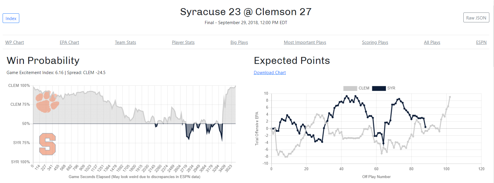
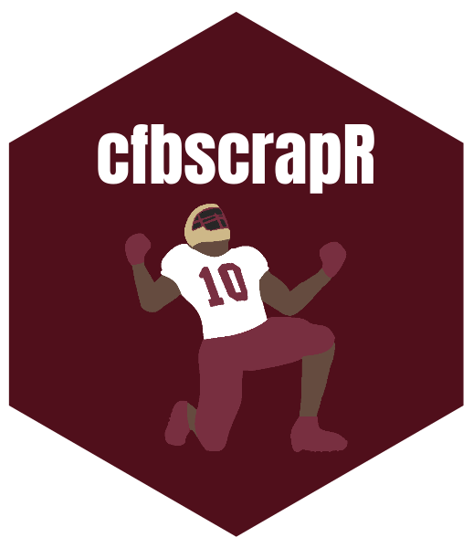
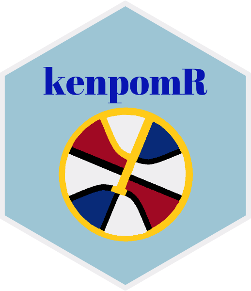
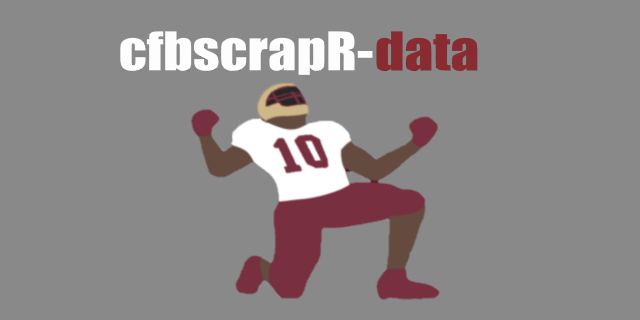

# Saiem is working on: 👋

<a href="https://twitter.com/saiemgilani"><a> <a href="https://www.linkedin.com/in/saiem-gilani/"><a> <a href="https://github.com/saiemgilani"><a> <a href="https://www.patreon.com/join/sportsdataverse?"><a>

##  [GameOnPaper.com](https://gameonpaper.com/cfb)

## NPM Modules

  

<a href='https://www.npmjs.com/package/sportsdataverse'></a>

<a href='https://www.npmjs.com/package/cbb-npm'></a>

## R Packages

## Data Repositories

  CFB, CBB, and Play-by-Plays 

<h3 align="left">Connect with me:</h3>

  

<a href="https://www.patreon.com/join/sportsdataverse?"><a> 

## **Languages and Tools:**

 
 

### **Machine Learning/Engineering**

               

### **JS**

                   

 
 
 
  ### **Cloud Platforms and CL/CI/CD**
        
 
 ### **Statistical Software**
  
         

****

  

<!--
**saiemgilani/saiemgilani** is a ✨ _special_ ✨ repository because its `README.md` (this file) appears on your GitHub profile.

Here are some ideas to get you started:

- 🔭 I’m currently working on ...
- 🌱 I’m currently learning ...
- 👯 I’m looking to collaborate on ...
- 🤔 I’m looking for help with ...
- 💬 Ask me about ...
- 📫 How to reach me: ...
- 😄 Pronouns: ...
- ⚡ Fun fact: ...
-->
