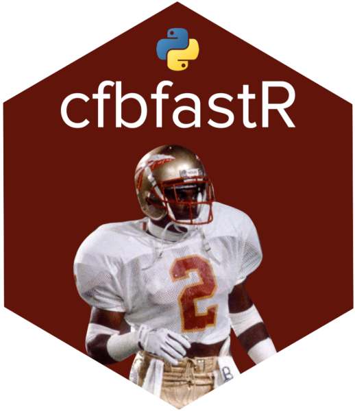
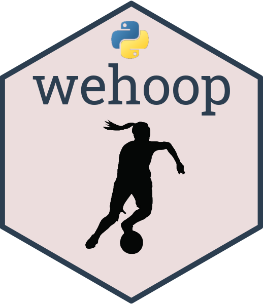
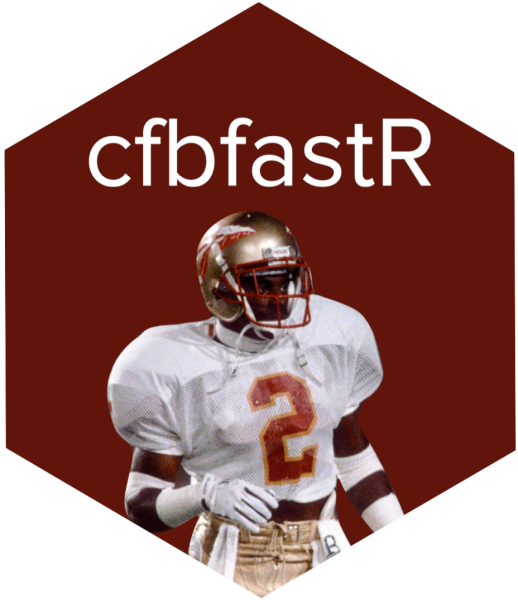
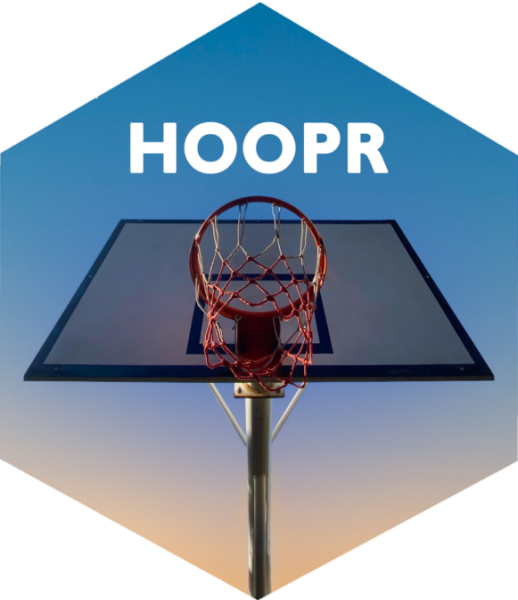
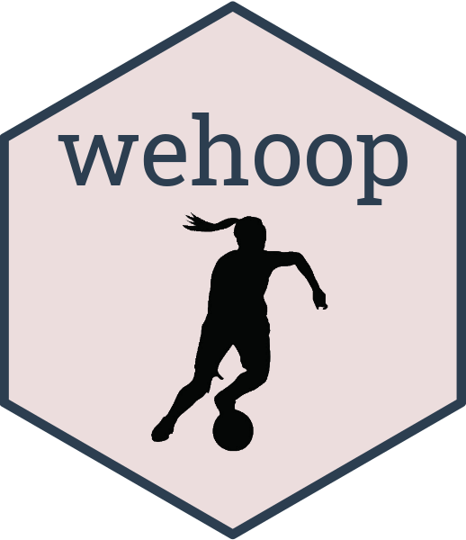
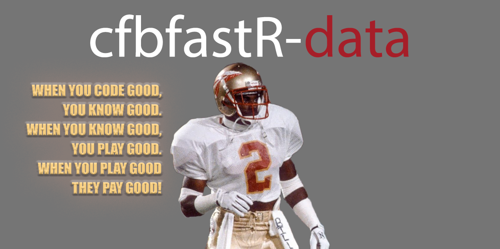
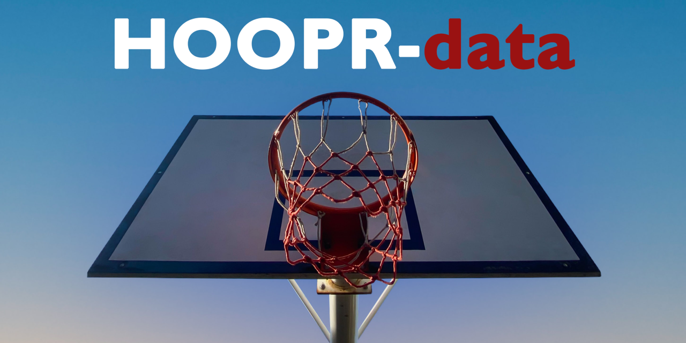
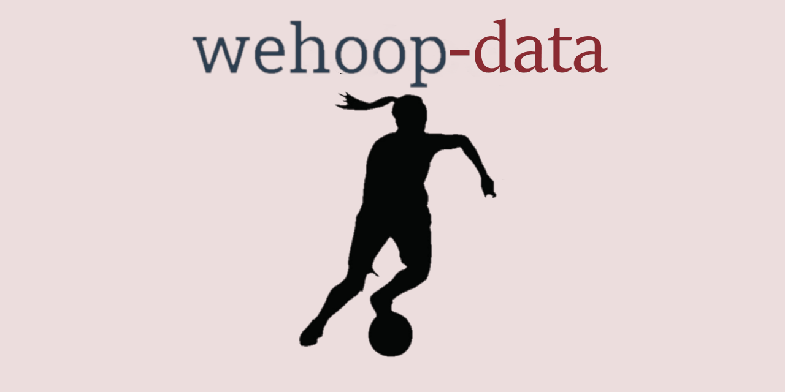

# Hi, I'm Saiem! ML Engineer, CV
I will be giving a presentation on the projects below at the [Carnegie Mellon Sports Analytics Conference](https://www.stat.cmu.edu/cmsac/conference/2021/). The paper I wrote for the conference was selected as the winner for the Data and Software contribution, Open Track for their reproducible research competition. 
The slides for my presentation can be found here:
[Slides](https://saiemgilani.github.io/The_SportsDataverse_Initiative/)
[Repository](https://github.com/saiemgilani/The_SportsDataverse_Initiative)
[Paper](https://www.stat.cmu.edu/cmsac/conference/2021/assets/pdf/SaiemGilani.pdf)

I'm working on:

Honestly, so many sports data projects that should have only taken me a couple weeks.
  - [sportsdataverse node.js source](https://github.com/saiemgilani/sportsdataverse) ([Docs](https://saiemgilani.github.io/sportsdataverse/))
  - [sportsdataverse-py source](https://github.com/saiemgilani/sportsdataverse-py) ([Docs](https://py.sportsdataverse.org/), [PyPI](https://pypi.org/project/sportsdataverse/))
  - [cfbfastR source](https://github.com/saiemgilani/cfbfastR) ([Docs](https://saiemgilani.github.io/cfbfastR/), [Data](https://github.com/saiemgilani/cfbfastR-data))
  - [hoopR source](https://github.com/saiemgilani/hoopR) ([Docs](https://saiemgilani.github.io/hoopR/), [Data](https://github.com/saiemgilani/hoopR-data))
  - [wehoop source](https://github.com/saiemgilani/wehoop) ([Docs](https://saiemgilani.github.io/wehoop/), [Data](https://github.com/saiemgilani/wehoop-data))
  - [recruitR source](https://github.com/saiemgilani/recruitR) ([Docs](https://saiemgilani.github.io/recruitR/))
  - [powerplay source](https://github.com/saiemgilani/powerplay) ([Docs](https://saiemgilani.github.io/powerplay/))
  - [@sportsdataverse/nhl](https://github.com/saiemgilani/sportsdataverse-nhl) 

  Projects I contribute to: 
  - [baseballr source](https://github.com/BillPetti/baseballr) ([Docs](https://BillPetti.github.io/baseballr/))
  - [whockeyR source](https://github.com/BenHowell71/whockeyR) ([Docs](https://BenHowell71.github.io/whockeyR/))

  Soon to be superseded:
  - [cfbfastR-py source](https://github.com/saiemgilani/cfbfastR-py) ([Docs](https://cfbfastR-py.sportsdataverse.org/), [PyPI](https://pypi.org/project/cfbfastR-py/), [Data](https://github.com/saiemgilani/cfbfastR-data))
  - [hoopR-py source](https://github.com/saiemgilani/hoopR-py) ([Docs](https://hoopR-py.sportsdataverse.org/), [PyPI](https://pypi.org/project/hoopR-py/), [Data](https://github.com/saiemgilani/hoopR-data))
  - [wehoop-py source](https://github.com/saiemgilani/wehoop-py) ([Docs](https://wehoop-py.sportsdataverse.org/), [PyPI](https://pypi.org/project/wehoop-py/), [Data](https://github.com/saiemgilani/wehoop-data))

They generally fall under the umbrella of the concept of the [SportsDataverse](https://sportsdataverse.org/ "The home page of the SportsDataverse Organization"). The general goal is to make sports data significantly more open and accessible, streamlining the process of gathering public data for research.

I have highlighted some of services we have been working on in this README. If you would like to help us in this endeavor, please feel encouraged to reach out. Please also consider donating to our Patreon below so we can continue to produce and host useful public resources.

<a href="https://twitter.com/saiemgilani"><a> <a href="https://www.linkedin.com/in/saiem-gilani/"><a> <a href="https://github.com/saiemgilani"><a> <a href="https://www.patreon.com/join/sportsdataverse?"><a>

##  [SportsDataverse.org](https://sportsdataverse.org/ "The home page of the SportsDataverse Organization")
##  [GameOnPaper.com](https://gameonpaper.com/cfb "Game on Paper: Live analytics for the modern age")

## Node.js modules  

[**Documentation**](https://saiemgilani.github.io/sportsdataverse/index.html)

  
<a href='https://www.npmjs.com/package/sportsdataverse'></a>

## Python Packages 

## R Packages 

## Data Repositories

Some other useful repositories:

<h3 align="left">Connect with me:</h3>

  

<a href="https://www.patreon.com/join/sportsdataverse?"><a> 

  archived 

## My GitHub stats

  

## **My preferred languages and tools:**

### **Machine Learning/Engineering**

               

### **JS**

                   

### **Cloud Platforms and CL/CI/CD**

       

****

<!--
**saiemgilani/saiemgilani** is a ✨ _special_ ✨ repository because its `README.md` (this file) appears on your GitHub profile.

Here are some ideas to get you started:

- 🔭 I’m currently working on ...
- 🌱 I’m currently learning ...
- 👯 I’m looking to collaborate on ...
- 🤔 I’m looking for help with ...
- 💬 Ask me about ...
- 📫 How to reach me: ...
- 😄 Pronouns: ...
- ⚡ Fun fact: ...
-->
